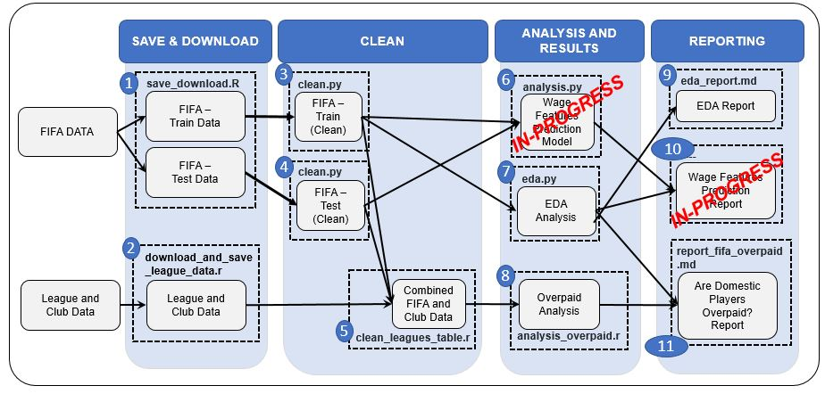

# Exploring FIFA Soccer Player Salaries

Contributors: 
 - Merve Sahin (merveshin)
 - Holly Williams (hwilliams10)
 - Huayue (Luke) Lu (mglu123)
 - Sakariya Aynashe (sakiga38)

 This is Group 410's project for DSCI 522 (Data Science workflows); a course in the Master of Data Science program at the University of British Columbia.

## Overview

For this project, we will be using the [Fifa 19 complete player dataset](https://www.kaggle.com/karangadiya/fifa19) [1] to answer the following two questions: 
1. **Predictive**: What are the most important features in determining a football (soccer) player's salary?
2. **Inferential**: Are domestic players valued more highly than foreign players? Or, in other words, we will be testing the hypothesis that the mean overpaid index is greater for domestic players than foreign players.

Due to time restrictions, as of Milestone 2, we have only had time to answer question 2. Our proposed plans to address question 1 in the future are outlined in our [proposal](https://github.com/UBC-MDS/DSCI_522_G410/blob/master/doc/proposal.md).

Most soccer leagues have rules limiting the number of foreign players that any team can have on their squad.  This leads one to wonder if rules like this actually result in domestic players being overvalued.  To test this hypothesis, we developed an 'overpaid index as a ratio of a player's FIFA ranking to salary and explored whether the mean overpaid index is greater for domestic players than foreign players in the top 5 soccer leagues.  We built linear models to test whether there was a significant relationship between a player's origin and their overpaid index and found that the relationship depends on the league the player is in.  Our final results showed that there was a significant relationship between mean overpaid index and player origin for 4 out of the 5 leagues.  However, the finding was that it is in fact foreign players who are more overvalued. Not only was our original hypothesis disproven; but instead we found that the opposite was true!

## Report

Our report on "Are Domestic Soccer Players Overpaid?" can be found [here](https://github.com/UBC-MDS/DSCI_522_G410/blob/master/doc/report_fifa_overpaid.md)

## Usage

The flow diagram below illustrates the overviews our analysis process and illustrates script orders and dependencies.



*Note: Steps 6 and 10 in the figure above relate to question 1 and are currently in progress / not ready for distribution*

To replicate the analysis, clone this GitHub repository, install the [dependencies](#dependencies) listed below, and run the following commands at the command line/terminal from the root directory of this project:

```make all```

To reset the repo to a clean state, with no intermediate or results files, run the following command at the command line/terminal from the root directory of this project:

```make clean```

## Dependencies

- Python 3.7.3 and Python packages:
  - docopt==0.6.2
  - pandas==0.24.2
  - numpy==1.17.2
  - altair==3.2.0
  - matplotlib.pyplot==3.1.1
  - seaborn==0.9.0
  - selenium==3.141.0

- R version 3.6.1 and R packages:
  - knitr==1.26
  - tidyverse==1.2.1
  - ggthemes==4.2.0
  - kableExtra==1.1.0
  - scales==1.1.0
  - broom==0.5.3
  - docopt==0.6.1
  - testthat==2.3.1
  - RCurl==1.98-1.1

- GNU make 4.2.1

- ChromeDriver 79.0.3945.36

*Note: ChromeDriver is required for saving Altair plots that are produced in our EDA analysis and then rendered in reports. If you are having issues producing Altair plots or installing ChromeDriver, please consult these links for help: [saving Altair plots](https://altair-viz.github.io/user_guide/saving_charts.html), [installing ChromeDriver](https://sites.google.com/a/chromium.org/chromedriver/)*


## Additional Links

#### Scripts

1. Download and save:
    - [FIFA data](https://github.com/UBC-MDS/DSCI_522_G410/blob/master/src/save_download.R) (includes splitting the data into test and train sets for use in predictive models)
    - [Club and league data](https://github.com/UBC-MDS/DSCI_522_G410/blob/master/src/download_and_save_league_data.R) (downloads and saves the data only)

2. Cleaning, processing, and wrangling:
    - [Cleaning FIFA data](https://github.com/UBC-MDS/DSCI_522_G410/blob/master/src/clean.py)
    - [Cleaning league data](https://github.com/UBC-MDS/DSCI_522_G410/blob/master/src/clean_leagues_table.r)

3. EDA
    - [EDA script](https://github.com/UBC-MDS/DSCI_522_G410/blob/master/src/eda.py)

4. Analysis
    - [Fitting Linear Models](https://github.com/UBC-MDS/DSCI_522_G410/blob/master/src/analysis_overpaid.r)

5. Report
    - [Report .md file](https://github.com/UBC-MDS/DSCI_522_G410/blob/master/doc/report_fifa_overpaid.md) on "Are Domestic Soccer Players Overpaid"
    - [EDA Report](https://github.com/UBC-MDS/DSCI_522_G410/blob/master/doc/eda_report.md)

#### Other Files

- [Code of Conduct](https://github.com/UBC-MDS/DSCI_522_G410/blob/master/CODE_OF_CONDUCT.md)
- [License](https://github.com/UBC-MDS/DSCI_522_G410/blob/master/LICENSE)
- [Contributing](https://github.com/UBC-MDS/DSCI_522_G410/blob/master/CONTRIBUTING.md)
- [Proposal](https://github.com/UBC-MDS/DSCI_522_G410/blob/master/doc/proposal.md)

## References

[1] Karan Gadiya. (2019, February). FIFA 19 complete player dataset. Retrieved January 16, 2020 from https://www.kaggle.com/karangadiya/fifa19.


