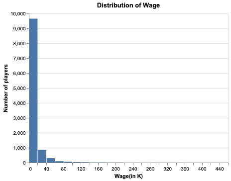
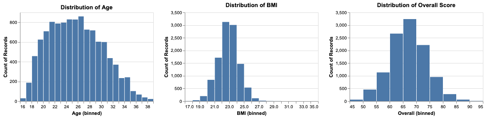
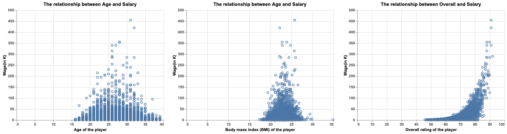
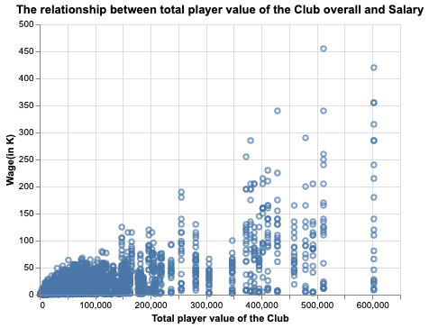
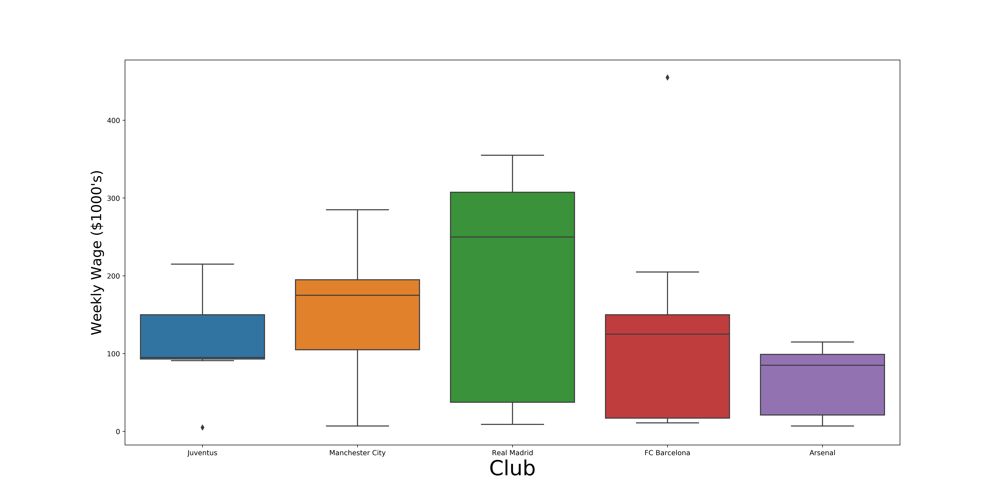
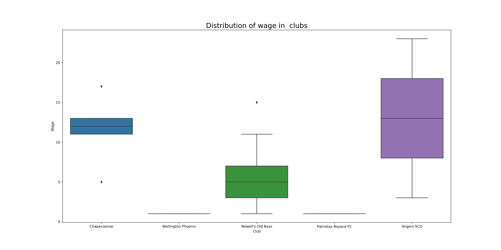

```{r setup, include=FALSE}
knitr::opts_chunk$set(echo = FALSE)
library(knitr)
library(kableExtra)
library(tidyverse)
library(scales)
```

```{r load model results, message = FALSE}
suppressWarnings(correlation_df <- read_csv("../results/data/wage_correlation_largest_20.csv"))
```

### Exploratory Data Analysis For Fifa 19 Dataset

We are making analysis about the Fifa 19 complete player dataset [1]. The dataset has about 80 attributes for all soccer players in FIFA 2019. The attributes include some basic information such as player age, club, position, wage, overall rating of the players according to their skills and performance as well as more detailed characteristics such as stamina, strength, interceptions, etc.

Our main goal of the project is that we are trying to understand the most important features in determining a soccer player's salary and whether the domestic soccer players are overpaid. To get more insight on the dataset, we start with looking at the distribution of the `Wage` column. 

```{r wage-distributions, echo=FALSE, fig.cap="Figure 1. The distribution of the players' wage.", out.width = '100%'}

```

So, we see that the distribution of the salary is higly skewed and there some outliers which can be considered as a sign that there maybe some features lead drastical increase in the salary.

We can look at the correlation matrix to see which features have a high correlation with the wage. These features will be valuable to use for our analysis.

```{r}
# print top 20 features ignoring first three which are other types of wage
wage_df <- correlation_df %>% 
  rename("Feature" = X1, 
         "Correlation Coefficient" = "Wage") %>% 
  mutate(Feature = case_when(Feature == 'Wage' ~ "Weekly Wage ($1000's)",
                             Feature == 'Overall' ~ "Overall FIFA Rating",
                             Feature == 'Special' ~ "Special Skills",
                             TRUE ~ Feature))
kable(wage_df[4:20,], caption = "**Table 1. Top 20 Features Correlated with Player Wage (Ignoring Wage/Salary Features)**")
```

From Table 1, we see that the `Overall FIFA rating`,` Potential` of the player and also some skill set of the players such as `Reaction`, `Composure` are highly correlated with a player's wage. We also see that `Club_value` is another good feature to look at.

We also need to be aware of that there might be some other features highly related with the wage, but not having a positive or negative correlation such as `Age` and `BMI`.

The following plots show the distribution of some candidates features.

```{r age_bmi_overall, echo=FALSE, fig.cap="Figure 1. The distribution of the players' wage.", out.width = '100%'}

```
The distribution of `Age` shows that the players are generally between the age 20 and 35. When we look at the overall ratings, there are only a few players having greater than 90, the general overall rating is around 65-70. The relation of the these attributes with the salary can be seen in the below plots.

```{r age_overall_wage, echo=FALSE, fig.cap="Figure 1. The distribution of the players' wage.", out.width = '100%'}

```

The first plot shows that the players of the age between 20 and 30 earning the most and after the age of 35 the wage drastically drops. The last plot suggests that there are high number of players having overall rating between 70-80 and the players with rating higher than 85 have very high salaries.

The `Club` of a player is also an important features to analysis 

```{r club_wage, echo=FALSE, fig.cap="Figure 1. The distribution of the players' wage.", out.width = '100%'}

```

So, the plot shows that there are gaps between clubs in terms of their values and it is likely that the richest clubs also have the highest paid players which is intuitive. But we also want to see the distrubtion of wage in some clubs and we firstly look at a few famous clubs.

```{r richest_club_wage, echo=FALSE, fig.cap="Figure 1. The distribution of the players' wage.", out.width = '100%'}

```
So, these clubs are high paid their players but even for them, the distribution of wage is different from each other. The following plot shows the distribution of the wage in any random clubs. 

```{r random_club_wage, echo=FALSE, fig.cap="Figure 1. The distribution of the players' wage.", out.width = '100%'}

```

So, the `Club value` is a good indicator in the salary of the players.

After all the analysis with plots and the correlation table, we decide to include some important features such as `Age`, `Club value`, `Overall` and some other features related with skill set of the players like `Potential`, `Ball controlling`, `Composure` in our model.

