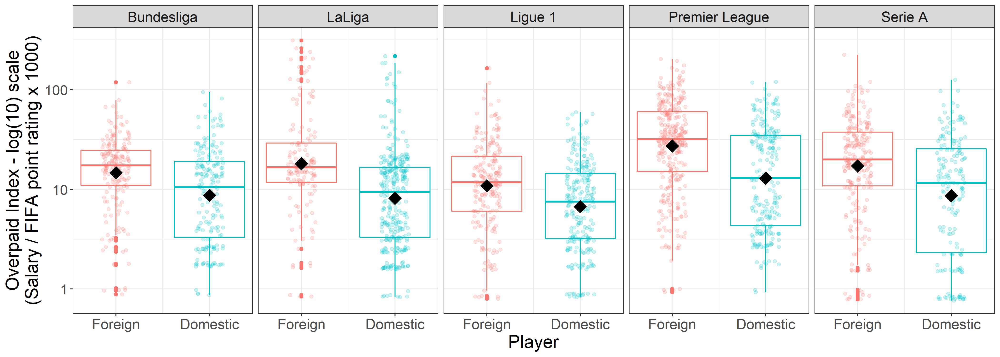

```{r setup, include=FALSE}
knitr::opts_chunk$set(echo = FALSE)
library(knitr)
library(tidyverse)
```

Most soccer leagues (and in fact many sports other sports leagues around the world) have rules limiting the number of foreign players that any team can have on their squad. In England's Premier League, the [Homegrown Player Rule](https://en.wikipedia.org/wiki/Homegrown_Player_Rule_(England)) requires that each team has a minimum of 8 'homegrown' (or 'domestic') players.  I've often wondered if rules like this actually result in domestic players being overvalued. What else could explain Manchester United paying over 30 million pounds for an average player like Luke Shaw?!  

For this project, we will attempt to answer the inferential question: *Are domestic soccer players overpaid?*, or in a more statistical context, we will be testing the hypothesis that *the mean overpaid index is greater for domestic players than foreign players*.

## Data Sources

For this project, we sourced player salaries and attributes from the [Fifa 19 complete player dataset](https://www.kaggle.com/karangadiya/fifa19) from [Kaggle](www.kaggle.com). The dataset was downloaded and uploaded to one of our team member's public github repository (see [here](https://raw.githubusercontent.com/mglu123/live_dash_demo/master/data-2.csv)).

Unfortunately, the Fifa dataset does not include information on leagues and locations, so we needed another data source to be able to link clubs with a league location and determine whether a player is a domestic or foreign player.  To do this, we manually created a dictionary table of `Club`, `League`, and `Country` values sourced from the official [EA Games website](https://www.ea.com/games/fifa/news/fifa-19-leagues-and-teams) and uploaded it to another public github repo (located [here](https://github.com/hwilliams10/fifa_data/blob/master/clubs_and_leagues.csv)).

## Methodology

We decided to limit our analysis to the top five global soccer leagues:

* Premier League (England)
* LaLiga (Spain)
* Bundesliga (Germany)
* Serie A (Italy)
* Ligue 1 (France)
 
To measure how overrated a player is, we decided to create an `Overpaid_Index`.  This index was calculated as a player's total salary (in millions) divided by their overall FIFA rating (which is a measure of how 'good' a player is) and multiplied by 1000.
$$ Overpaid\ Index = \frac{salary (\$M)}{FIFA\ rating}1000 $$


### Wrangling and Cleaning

When we first went to join the dataframes, there were many mismatching `Club` names between the two datasets (for example, things like `Manchester United` versus `Manchester Utd`).  After joining the tables,we also made new columns for the following features:
 
- `Salary`(in millions) was calculated based on the weekly `Wage` data from the FIFA dataset
- `Domestic` was assigned a value of 1 when a player had the same `Nationality` as the league's `Country`
- `Overpaid_Index` was calculated as described above
 
 This wrangling and cleaning step is performed by the `cleaning_leagues_table.r` script in the `src` directory.
 

### Analysis and Results

To test our hypothesis, we first used the 




## Conclusions


# References